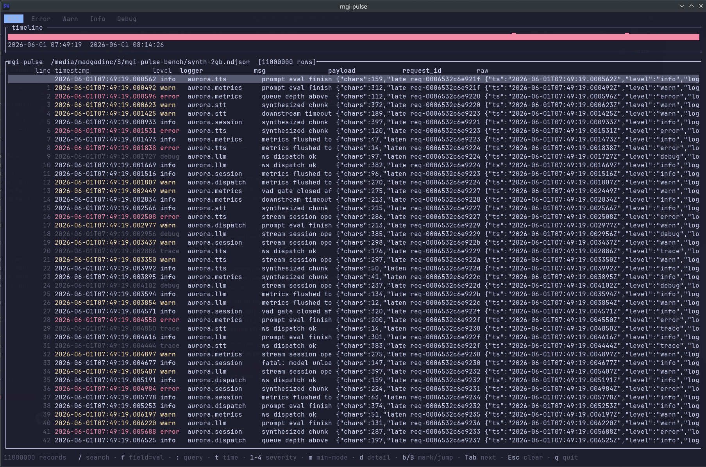
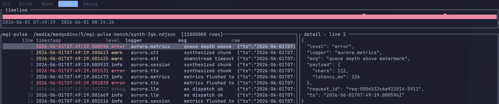
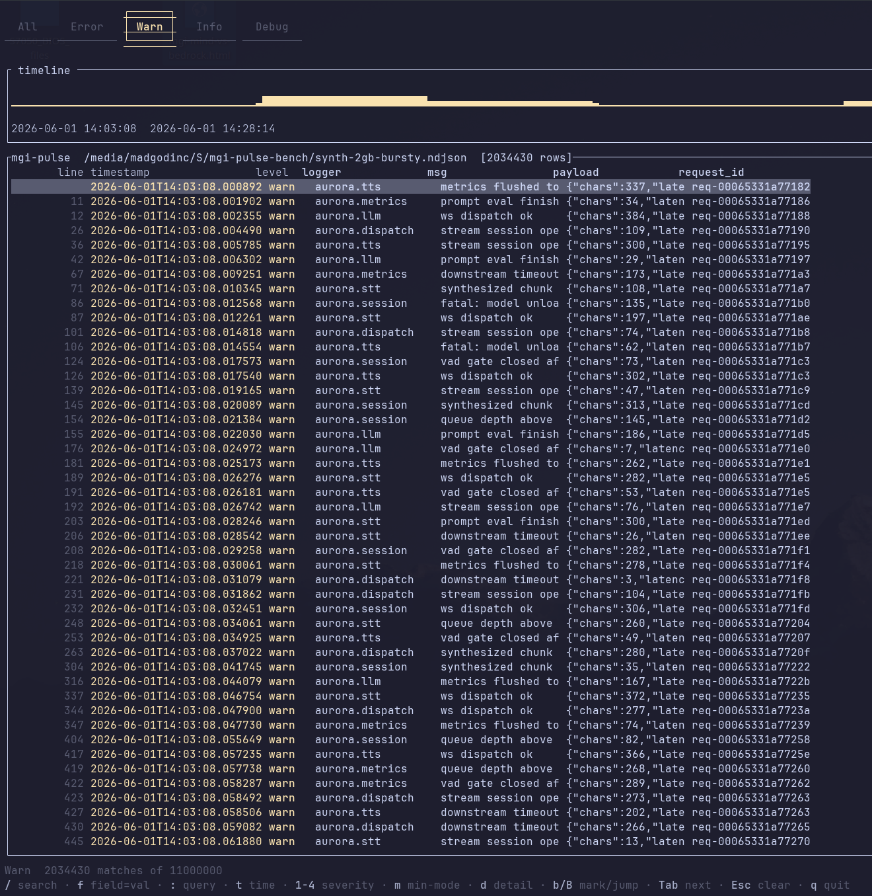
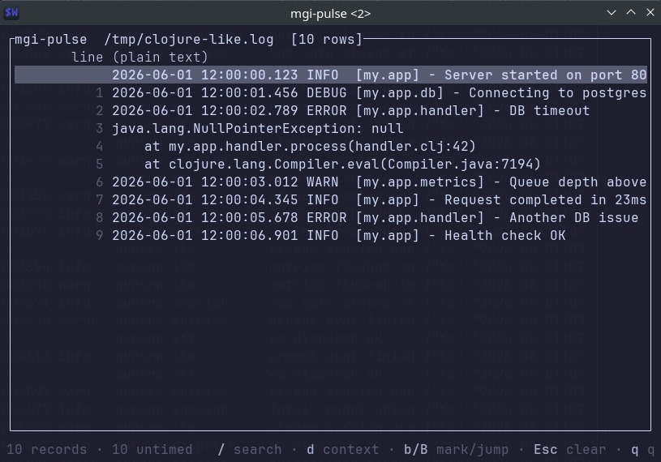
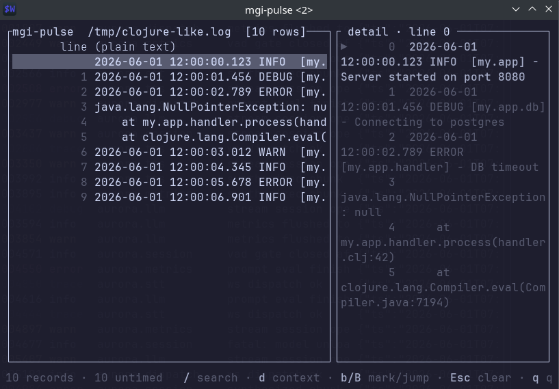

# mgi-pulse

A local-only TUI navigator for structured logs. Not browse logs, navigate them.



## Why

Most log tools either tail text (`less`, `tail -F`) or ship a pipeline (Loki,
Vector, an OTEL collector). `mgi-pulse` sits in the gap: open one or many
log files locally, get a typed table with severity tabs, a regex search, and
a one-line query DSL, quit. No daemon, no Docker, no index on disk, no
config file.

A log is not a text file to scroll, it is a structured event stream to
navigate by time, by structure, and by severity. `mgi-pulse` is built around
that idea — and falls back gracefully to a `less`-style view when the input
doesn't have structure to navigate.

## Install

**Pre-built Linux x86_64 binary** (musl-static, no runtime deps):

```sh
curl -L https://github.com/madgodinc/mgi-pulse/releases/latest/download/mgi-pulse-v0.2.0-x86_64-unknown-linux-musl.tar.gz | tar -xz
./mgi-pulse --help
```

**Build from source** (any Rust toolchain ≥ 1.83):

```sh
cargo install --git https://github.com/madgodinc/mgi-pulse mgi-pulse
```

macOS and Windows builds are CI-checked on each commit but pre-built
binaries for those platforms are not shipped yet — build from source on
those platforms for now.

## Quickstart

```sh
# Structured inputs (auto-detected for the first three)
mgi-pulse app.log.ndjson                  # NDJSON
mgi-pulse --format=logfmt go.log          # Go / Heroku key=value pairs
mgi-pulse --format=edn clojure.edn        # Clojure {:key value} maps
mgi-pulse --format=python app.log         # Python logging default format

# Compressed files (gzip and zstd auto-detected by magic bytes)
mgi-pulse app.log.gz
mgi-pulse archive.log.zst

# Multiple files merge by timestamp; stdin streams in real time
mgi-pulse a.ndjson b.ndjson c.ndjson
tail -F live.log | mgi-pulse -

# Native follow — backfill existing content, then track new lines
# in a background thread. Inode-based rotation detection.
mgi-pulse --follow live.log

# Plain text falls into less-mode — line numbers, regex, navigation,
# no fake columns
mgi-pulse /var/log/something.log
```

Inside the TUI: `Tab` cycles severity views, `/` opens regex search, `:`
opens the query DSL, `f` opens a `field=value` filter, `t` jumps to a
timestamp, `d` toggles the detail pane, `b` bookmarks the focused row,
`q` quits.



### Query DSL

Press `:` (or `;` on layouts where `:` is awkward) to enter a one-line
query. Compiles into the same filter machinery the table already uses,
so it composes with the active tab and the legacy prompts:

```text
level=error
level=error AND msg~/timeout/
(level=error OR level=warn) AND NOT logger=health-check
level=error AND (msg~/timeout/ OR msg~/refused/)
ts>=2026-06-01T12:00 AND ts<2026-06-01T13:00
logger=my.app AND msg~/conn(ection)? lost/ AND level!=debug
```

Field operators: `=`, `!=`, `~/regex/`, and `>`, `>=`, `<`, `<=` (the
comparison ops only apply to `ts`). Boolean composition: `AND`, `OR`,
`NOT`, parentheses. Precedence is the conventional one — `NOT` binds
tightest, then `AND`, then `OR`. Keywords are uppercase ASCII so they
don't collide with field names like `and_count`. Syntax errors are
reported in the status bar before any scan.




### Less-mode (plain-text fallback)



If the file has no parseable structure (e.g. `log4j`/`logback`
defaults, raw stdout, Clojure println output), `mgi-pulse` collapses
into a `less`-style view: line numbers + raw payload across the full
width, no empty columns, no empty severity tabs. Regex search, the
DSL, and cursor navigation still work. The detail pane (`d`) shows
±5 lines of context so multi-line stack traces read as a block.



This makes the binary useful as a no-config `less` replacement even
when the input is unstructured — you just lose the typed table.

## Features

- **Formats:** NDJSON, logfmt, EDN, Python `logging` default, syslog RFC 5424,
  CSV / TSV, Apache / nginx access logs (Common + Combined), Java logback /
  log4j2, systemd `journalctl -o json`, plus a **generic regex-extraction**
  for everything else. Auto-detect from the first ~16 KiB; force with
  `--format=python|syslog|csv|tsv|access|logback|journalctl|regex`. For
  CSV/TSV the first row is the column header. Access-log severity is
  synthesised from the HTTP status code. Java stack traces fold into
  the previous record. journalctl maps `PRIORITY` to severity and
  `__REALTIME_TIMESTAMP` to time.
- **Regex extraction:** `--pattern='(?P<ts>...)\s+(?P<level>...)\s+(?P<msg>.*)'`
  turns any plain-text log into a structured stream. Named captures
  become fields the DSL and the table can use. `ts` parses as RFC3339
  (with prefix padding for short timestamps); `level` maps to a
  severity name.
- **Compression:** gzip and zstd — detected by magic bytes, not extension.
- **Multi-line records:** stack traces and continuation lines fold into the
  preceding record. Format-specific: Java/Python tracebacks merge into one
  row, NDJSON keeps its one-record-per-line guarantee.
- **Filters:** regex (whole line), `field=value` (typed projection), severity
  (strict or `min+`), and the query DSL — all composed with AND.
- **Severity tabs:** `All`, `Error`, `Warn`, `Info`, `Debug+Trace` at startup.
  `Ctrl-T` opens a new tab, `Ctrl-W` closes one. Each tab keeps its own
  filter stack, cursor, scroll, detail toggle, and bookmark list.
- **Timeline pane:** overview histogram, severity-coloured bars, time range
  labels.
- **Detail pane:** pretty-printed record under the cursor; ±5-line context
  view in less-mode.
- **Bookmarks:** `b` toggles a bookmark on the focused row, `B` cycles
  through them. A yellow star in the gutter marks bookmarked rows.
  For single-file sources, bookmarks persist between sessions via a
  sidecar at `$XDG_DATA_HOME/mgi-pulse/bookmarks.json` (default
  `~/.local/share/mgi-pulse/bookmarks.json`). The sidecar is keyed by
  the file's inode + size; a rotated or truncated file drops its
  saved bookmarks automatically. Stdin and merged sources skip
  persistence — their bookmarks live only for the session.
- **Themes:** `--theme=dark|light|nocolor` (default dark). `nocolor` uses
  only modifiers so the output stays readable when piped through `script` or
  on terminals without ANSI colour. `NO_COLOR=1`, `TERM=dumb`, and a
  non-tty stdout each force `nocolor` regardless of `--theme`
  ([no-color.org](https://no-color.org/)).
- **k-way merge** of multiple files by timestamp; line IDs become
  time-sorted in the merged view.
- **Schema inference** over the first 10k records produces auto-derived
  columns. `R` rescans the schema over the visible window when the initial
  10k turn out to be a boot banner.
- Static binary, ~3.4 MB stripped, zero config files.

## Keyboard reference

| Key | Action | Notes |
|---|---|---|
| `q` / `Ctrl-C` | Quit | |
| `/` | Open regex search | `Enter` applies, `Esc` cancels |
| `:` | Open query DSL | `level=error AND msg~/boom/` |
| `f` | Open `field=value` filter | Composes with regex and DSL (AND) |
| `t` | Jump to a timestamp | RFC3339 prefix, e.g. `2026-06-01T12:00` |
| `s` | Save filtered view to a file | Prompt for path; writes one record per line |
| `<` / `>` | Move the timeline scrub cursor | First press activates scrub; Shift jumps 10 bins |
| `+` / `-` | Zoom the timeline in / out | Halves / doubles the visible range around the cursor |
| `Enter` | Apply scrub as a time-range filter | Single bin if no zoom, the full zoom window otherwise |
| `d` | Toggle detail pane | Pretty-printed JSON; ±5 context in less-mode |
| `m` | Toggle severity strict / min-mode | `Warn` vs `Warn+` |
| `0`–`4` | Severity filter on active tab | `0` clears, `1` Error+Fatal, `2` Warn, `3` Info, `4` Debug+Trace |
| `b` | Toggle bookmark on focused row | Yellow ★ in the gutter |
| `B` | Jump to next bookmark | Wraps at the end |
| `Esc` | Cancel scrub, or clear filters | First press cancels an active scrub; otherwise clears all filters on the tab |
| `R` | Rescan schema | Useful when the initial 10k were a boot banner |
| `Tab` / `Shift-Tab` | Next / previous tab | |
| `Ctrl-T` / `Ctrl-W` | Open new / close current tab | Last close quits |
| `Up` / `Down` | Move cursor | One row |
| `PageUp` / `PageDown` | Move cursor | 20 rows |
| `g` / `G` | Jump to start / end | |
| Mouse wheel | Scroll | One row per tick |
| Mouse click | Switch to a tab | In the tab bar only |

### Mouse capture and terminal selection

Mouse capture is on by default so the wheel scrolls the table and you can
click tabs. That intercepts text selection too — hold **Shift** while you
drag to let the terminal handle the selection directly (standard TUI
convention; works in WezTerm, Alacritty, GNOME-Terminal, Konsole,
iTerm2). Pass `--no-mouse` to disable capture entirely if you need the
unmodified terminal selection back — useful over SSH or with a
copy-on-select setup.

### Static files vs live files (mmap safety)

`mgi-pulse` `mmap`s plain files for speed. **This is safe for static log
snapshots but unsafe for files that another process may truncate or
replace while you're viewing them** — reading past a truncated mmap
region delivers SIGBUS to the process, killing it. That's a Unix
mechanic, not a Rust error, so we can't catch it.

Two rules of thumb:

- **Static / archived logs:** open them directly. `mgi-pulse app.log`,
  `mgi-pulse error.log.1`, `mgi-pulse 2026-06-01.ndjson` — all safe.
- **Active / live logs:** pipe through `tail -F`:

  ```sh
  tail -F /var/log/app.log | mgi-pulse -
  ```

  `tail -F` survives rotation and feeds `mgi-pulse` via stdin, which
  uses owned buffers (no mmap) and is robust to whatever the writer
  does to the file underneath.

Native `--follow` is also available — `mgi-pulse --follow app.log`
backfills the existing content synchronously, then a background
worker keeps the index alive with every new line the file picks up.
Inode-based rotation detection means `logrotate` doesn't kill the
session.

## What it doesn't do (yet)
- **Plain-text regex extraction.** Non-structured logs (raw stdout,
  `log4j` defaults) fall into less-mode — the table shows the raw
  payload but doesn't synthesise typed fields from a regex template.
- **Background indexing for huge files.** A 30 GB file still blocks
  the UI during the initial index build. `--follow` does have a
  background worker for live appends; the historical backfill is
  still synchronous.
- **Remote, multi-host, persistence.** Different product.

## Custom field names

If your log shape uses non-default names for the timestamp or level,
override them:

```sh
mgi-pulse --time-field=@timestamp --level-field=severity_text app.log   # ECS
mgi-pulse --time-field=@t app.log                                       # Serilog
mgi-pulse --time-field=eventTime app.log                                # k8s audit
```

## Status

Hobby project, single developer. The on-disk format is none (nothing is
persisted), but the key bindings and CLI surface are not stable yet —
breaking changes between minor versions are possible. Feedback and bug
reports welcome on the [issue tracker](https://github.com/madgodinc/mgi-pulse/issues).

## License

Apache-2.0. See [LICENSE](LICENSE).

## Acknowledgments

- [ratatui](https://github.com/ratatui/ratatui) — TUI rendering
- [memmap2](https://github.com/RazrFalcon/memmap2-rs) — mmap
- [serde](https://serde.rs/) / [serde_json](https://github.com/serde-rs/json) — borrowed JSON parsing
- [regex](https://github.com/rust-lang/regex) — search
- [flate2](https://github.com/rust-lang/flate2-rs) / [zstd](https://github.com/gyscos/zstd-rs) — decompression
